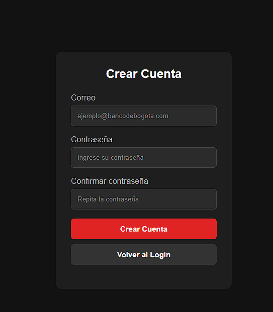
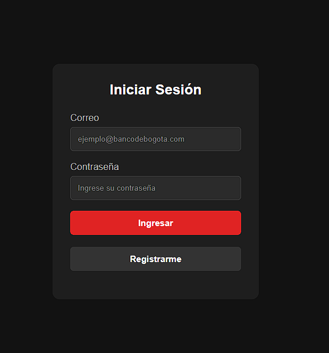
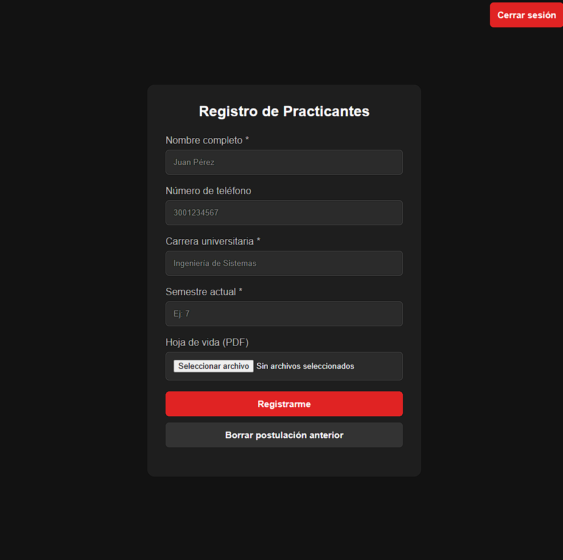
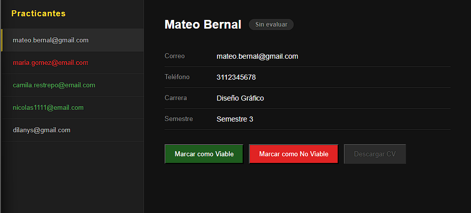

# Aplicación sencilla postulación y revisión de practicantes
## Herramientas de desarrollo:
- FrontEnd simple con HTML, CSS y Java Script
- Backend realizado con Flask (python)
- Base de datos, se usó una base de datos local con PostgreSQL

## Intrucciones para instalar
1. Clonar el repositorio.
2. Crear una base de datos en Postgre SQL y ejecutar el script *crear_archivos.sql* para crear las tablas.
3. Reeemplazar los datos de la base de datos y el usuario creados en el archivo .env (la secret key es la llave del hash).
4. Crear carpeta */uploads* donde se guardarán por defecto los archivos pdf.
5. Crear un entorno virtual e instalar los paquetes del archivo *requirements.txt*.
6. Iniciar aplicación ejecutando el archivo *app.py*.
7. (recomendado) Crear usuarios de prueba antes de ingresar como reclutador.
8. El usuario y contraseña del reclutador por defecto son: admin@gmail.com y admin123

## Capturas de pantalla

